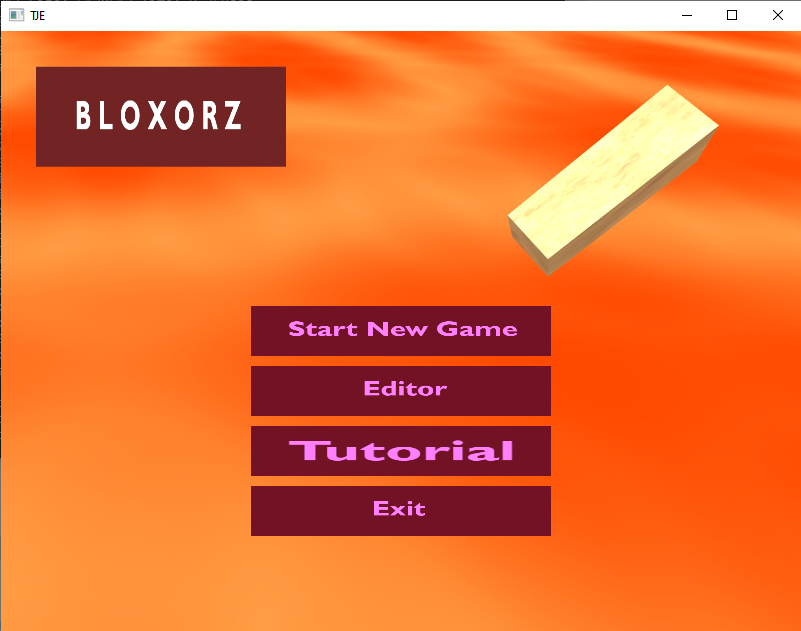
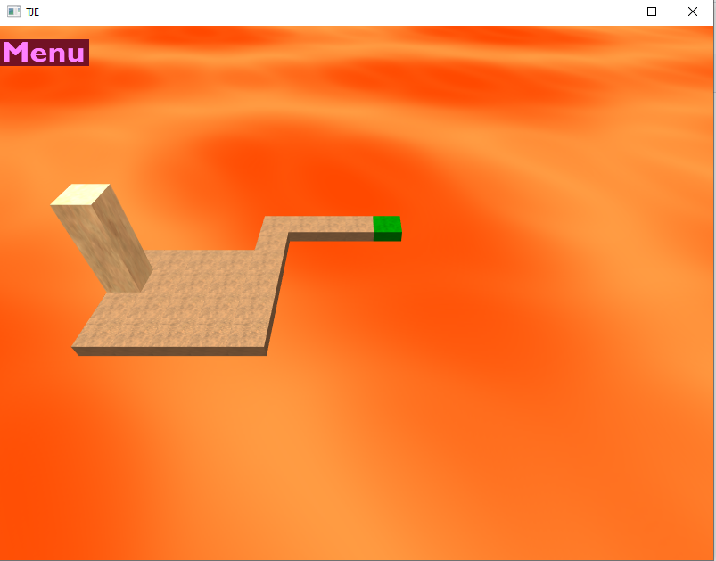
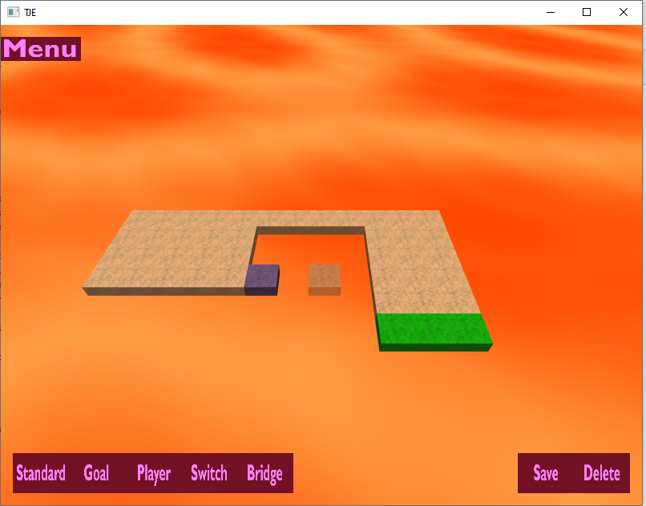

# Bloxorx #
This is a simple 3D game developed on top of a C++ framework based on OpenGL and SDL.
The game consists of moving a rectangle to a specific goal without falling. The game contains an editor where the player can create maps and add them to the existing levels.

## Framework ##

The framework was developed by javi.agenjo@gmail.com and it's based on a C++ layer on top of SDL and OpenGL to help create games or visual applications.
It only provides the basic GPU abstraction (Meshes, Textures, Shaders, Application).

It contains the basics to do something nice:
- Mesh, Texture, Shader and FBO classes
- Vector2,Vector3,Vector4,Matrix44 and Quaternion classes
- Meshes have a ray-mesh and sphere-mesh collision method (thanks to library Coldet)
- Parser to load OBJ, PNG and TGA. Re-stores meshes in binary for faster load.
- Supports skinned animated meshes using own format (you must use a web tool to convert them).

Enough to make gamejam games pretty easily.

## Installation ##

It comes with a Visual Studio solution, but the code should compile in any platform that supports SDL.

## Compiling in Linux

Remember to install the libraries:

sudo apt-get install libsdl2-dev freeglut3 freeglut3-dev

and then just use the makefile:

make

